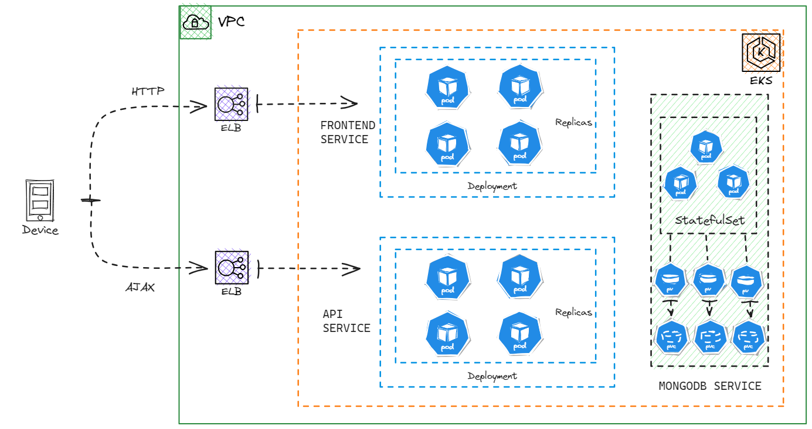

# Cloud-native-voting-app

This is a real-time DevOps project using tools like AWS, Docker, Kubernetes, ReactJS, Golang and MongoDB.
In this project, we aim to deploy and running a voting web application on Elastic Kubernetes Service

## Architecture Diagram

## Tech Stack
The project is a voting app using microservice architect with frontend and backend service:

- **Frontend Service**: The frontend of this application was built by using React. Provide a responsive and interactive interface for votings
- **Backend Service**: The backend of this application was programmed by Golang. It provides the handling user voting requests.
- **Database**: MongoDB was used for database backend. It was configured with a replica set.
  
## Kubernetes Resources
By using Kubernetes and an amount of its resources, the application can deploy and manage effectively:

- **Pod**: the smallest deployable unit in Kubernetes, representing a single instance of a running process. It contain one or more containers
- **ReplicaSet**: Ensures a specified number of pod replicas are running at all times
- **Deployment**: Manages ReplicaSets and provides declarative updates to applications
- **Service**: Expose pods and services as network endpoints. It enables load balancing and service discovery
- **Secret**: Store sensitive information, such as API keys or credentials, required by the application securely
- **Namespace**: Provides a logical separation of resources within a cluster. It's useful for multi-tenancy and resource isolation.
- **StatefulSet**: Manages stateful applications with unique network identities and stable storage.
- **PersistentVolume (PV) and PersistentVolumeClaim (PVC)**:  PV represents a piece of networked storage in the cluster, while PVC is a request for storage by a user.

## Steps for Project:

### Installing Kubectl and AWS CLI

### Launch EC2 Instance

### EKS Cluster Setup

### Add Node Groups

### Deploy MongoDB through StatefulSet

### Create Headless Service for MongoDB

### Setup ReplicaSet on MongoDB

### Load Data in Database

### Set Golang API using Deployments

### Create MongoDB Secret

### Expose API deployment through Application Load Balancer

### Testing API

### Deploy Frontend Pods

### Expose Frontend deployment through Application Load Balancer
